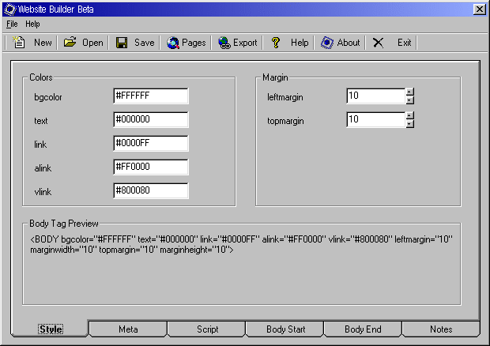



## Website Builder Beta

### Description

Website Builder provides an easier method for HTML coders to maintain the look and feel of a website. Website Builder uses a master template which is applied to HTML pages contained in a database. This is a simple project, however, it has saved me many hours of HTML coding over the last few weeks for my website and my clients' websites.

The included modules are mostly compilations of other people's work here on PSC and I don't make any claim to them.

I hope you all enjoy my first PSC upload!
 
### More Info
 
I'm using VB6 SP5. I recommend the same to others.

Add a reference to MS DAO 3.6

             |
---                |---
**Submitted On**   |2001-05-28 13:45:28
**By**             |[Jim Hunt](https://github.com/Planet-Source-Code/PSCIndex/blob/master/ByAuthor/jim-hunt.md)
**Level**          |Intermediate
**User Rating**    |4.3 (13 globes from 3 users)
**Compatibility**  |VB 6\.0
**Category**       |[Complete Applications](https://github.com/Planet-Source-Code/PSCIndex/blob/master/ByCategory/complete-applications__1-27.md)
**World**          |[Visual Basic](https://github.com/Planet-Source-Code/PSCIndex/blob/master/ByWorld/visual-basic.md)
**Archive File**   |[Website Bu201715282001\.zip](https://github.com/Planet-Source-Code/jim-hunt-website-builder-beta__1-23527/archive/master.zip)

